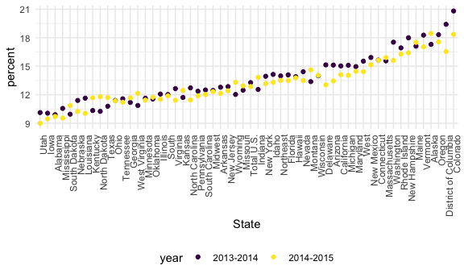
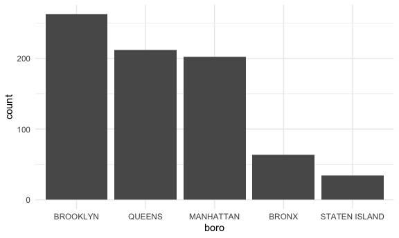
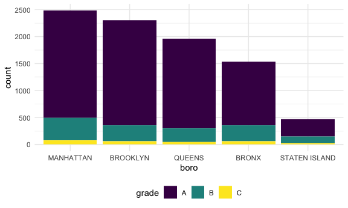

Strings and Factors
================
Mia Isaacs
2024-10-15

``` r
library(tidyverse)
```

    ## ── Attaching core tidyverse packages ──────────────────────── tidyverse 2.0.0 ──
    ## ✔ dplyr     1.1.4     ✔ readr     2.1.5
    ## ✔ forcats   1.0.0     ✔ stringr   1.5.1
    ## ✔ ggplot2   3.5.1     ✔ tibble    3.2.1
    ## ✔ lubridate 1.9.3     ✔ tidyr     1.3.1
    ## ✔ purrr     1.0.2     
    ## ── Conflicts ────────────────────────────────────────── tidyverse_conflicts() ──
    ## ✖ dplyr::filter() masks stats::filter()
    ## ✖ dplyr::lag()    masks stats::lag()
    ## ℹ Use the conflicted package (<http://conflicted.r-lib.org/>) to force all conflicts to become errors

``` r
library(rvest)
```

    ## 
    ## Attaching package: 'rvest'
    ## 
    ## The following object is masked from 'package:readr':
    ## 
    ##     guess_encoding

``` r
library(p8105.datasets)
```

``` r
knitr::opts_chunk$set(
    echo = TRUE,
    warning = FALSE,
  fig.width = 6,
  fig.asp = .6,
  out.width = "90%"
)
theme_set(theme_minimal() + theme(legend.position = "bottom"))
options(
  ggplot2.continuous.colour = "viridis",
  ggplot2.continuous.fill = "viridis"
)
scale_colour_discrete = scale_colour_viridis_d
scale_fill_discrete = scale_fill_viridis_d
```

# let’s do strings

``` r
string_vec = c("my", "name", "is", "jeff")

str_detect(string_vec, "jeff")
```

    ## [1] FALSE FALSE FALSE  TRUE

``` r
str_replace(string_vec, "e", "E")
```

    ## [1] "my"   "namE" "is"   "jEff"

``` r
string_vec = c(
  "i think we all rule for participating",
  "i think i have been caught",
  "i think this will be quite fun actually",
  "it will be fun, i think"
  )

str_detect(string_vec, "i think")
```

    ## [1] TRUE TRUE TRUE TRUE

``` r
str_detect(string_vec, "^i think")
```

    ## [1]  TRUE  TRUE  TRUE FALSE

``` r
str_detect(string_vec, "i think$")
```

    ## [1] FALSE FALSE FALSE  TRUE

``` r
string_vec = c(
  "Time for a Pumpkin Spice Latte!",
  "went to the #pumpkinpatch last weekend",
  "Pumpkin Pie is obviously the best pie",
  "SMASHING PUMPKINS -- LIVE IN CONCERT!!"
  )

str_detect(string_vec, "pumpkin")
```

    ## [1] FALSE  TRUE FALSE FALSE

``` r
str_detect(string_vec, "[Pp]umpkin")
```

    ## [1]  TRUE  TRUE  TRUE FALSE

``` r
string_vec = c(
  '7th inning stretch',
  '1st half soon to begin. Texas won the toss.',
  'she is 5 feet 4 inches tall',
  '3AM - cant sleep :('
  )

str_detect(string_vec, "^[0-9][a-zA-Z]")
```

    ## [1]  TRUE  TRUE FALSE  TRUE

``` r
string_vec = c(
  'Its 7:11 in the evening',
  'want to go to 7-11?',
  'my flight is AA711',
  'NetBios: scanning ip 203.167.114.66'
  )

str_detect(string_vec, "7.11")
```

    ## [1]  TRUE  TRUE FALSE  TRUE

``` r
string_vec = c(
  'The CI is [2, 5]',
  ':-]',
  ':-[',
  'I found the answer on pages [6-7]'
  )

str_detect(string_vec, "\\[")
```

    ## [1]  TRUE FALSE  TRUE  TRUE

# factors

``` r
sex_vec = factor(c("male", "male", "female", "female"))

as.numeric(sex_vec)
```

    ## [1] 2 2 1 1

do some releveling

``` r
sex_vec = fct_relevel(sex_vec, "male")

as.numeric(sex_vec)
```

    ## [1] 1 1 2 2

# NSDUH

``` r
url = "http://samhda.s3-us-gov-west-1.amazonaws.com/s3fs-public/field-uploads/2k15StateFiles/NSDUHsaeShortTermCHG2015.htm"

drug_use_html = read_html(url)
```

``` r
table_marj = 
  drug_use_html |> 
  html_table() |> 
  first() |>
  slice(-1) 

table_marj
```

    ## # A tibble: 56 × 16
    ##    State     `12+(2013-2014)` `12+(2014-2015)` `12+(P Value)` `12-17(2013-2014)`
    ##    <chr>     <chr>            <chr>            <chr>          <chr>             
    ##  1 Total U.… 12.90a           13.36            0.002          13.28b            
    ##  2 Northeast 13.88a           14.66            0.005          13.98             
    ##  3 Midwest   12.40b           12.76            0.082          12.45             
    ##  4 South     11.24a           11.64            0.029          12.02             
    ##  5 West      15.27            15.62            0.262          15.53a            
    ##  6 Alabama   9.98             9.60             0.426          9.90              
    ##  7 Alaska    19.60a           21.92            0.010          17.30             
    ##  8 Arizona   13.69            13.12            0.364          15.12             
    ##  9 Arkansas  11.37            11.59            0.678          12.79             
    ## 10 Californ… 14.49            15.25            0.103          15.03             
    ## # ℹ 46 more rows
    ## # ℹ 11 more variables: `12-17(2014-2015)` <chr>, `12-17(P Value)` <chr>,
    ## #   `18-25(2013-2014)` <chr>, `18-25(2014-2015)` <chr>, `18-25(P Value)` <chr>,
    ## #   `26+(2013-2014)` <chr>, `26+(2014-2015)` <chr>, `26+(P Value)` <chr>,
    ## #   `18+(2013-2014)` <chr>, `18+(2014-2015)` <chr>, `18+(P Value)` <chr>

``` r
  table_marj = 
  drug_use_html |> 
  html_table() |> 
  first() |>
  slice(-1) |> 
  select(-contains("P value")) |> 
  pivot_longer(
    cols = -State,
    names_to = "age_year",
    values_to = "percent"
  ) |> 
  separate(age_year, into = c("age", "year"), sep = "\\(") |> 
  mutate(
    year = str_replace(year, "\\)", ""),
    percent = str_remove(percent, "[a-c]$"),
    percent = as.numeric(percent),
  )

table_marj
```

    ## # A tibble: 560 × 4
    ##    State      age   year      percent
    ##    <chr>      <chr> <chr>       <dbl>
    ##  1 Total U.S. 12+   2013-2014   12.9 
    ##  2 Total U.S. 12+   2014-2015   13.4 
    ##  3 Total U.S. 12-17 2013-2014   13.3 
    ##  4 Total U.S. 12-17 2014-2015   12.9 
    ##  5 Total U.S. 18-25 2013-2014   31.8 
    ##  6 Total U.S. 18-25 2014-2015   32.1 
    ##  7 Total U.S. 26+   2013-2014    9.63
    ##  8 Total U.S. 26+   2014-2015   10.2 
    ##  9 Total U.S. 18+   2013-2014   12.9 
    ## 10 Total U.S. 18+   2014-2015   13.4 
    ## # ℹ 550 more rows

``` r
table_marj |>
  filter(age == "12-17") |> 
  mutate(State = fct_reorder(State, percent)) |> 
  ggplot(aes(x = State, y = percent, color = year)) + 
    geom_point() + 
    theme(axis.text.x = element_text(angle = 90, hjust = 1))
```



# NYC restaurant inspections

``` r
data("rest_inspec")

rest_inspec
```

    ## # A tibble: 397,584 × 18
    ##    action          boro  building  camis critical_flag cuisine_description dba  
    ##    <chr>           <chr> <chr>     <int> <chr>         <chr>               <chr>
    ##  1 Violations wer… MANH… 425      4.15e7 Not Critical  Italian             SPIN…
    ##  2 Violations wer… MANH… 37       4.12e7 Critical      Korean              SHIL…
    ##  3 Violations wer… MANH… 15       4.11e7 Not Critical  Café/Coffee/Tea    CITY…
    ##  4 Violations wer… MANH… 35       4.13e7 Critical      Korean              MADA…
    ##  5 Violations wer… MANH… 1271     5.00e7 Critical      American            THE …
    ##  6 Violations wer… MANH… 155      5.00e7 Not Critical  Donuts              DUNK…
    ##  7 Violations wer… MANH… 1164     5.00e7 Critical      Salads              SWEE…
    ##  8 Violations wer… MANH… 37       4.12e7 Not Critical  Korean              SHIL…
    ##  9 Violations wer… MANH… 299      5.01e7 Not Critical  American            PRET…
    ## 10 Violations wer… MANH… 53       4.04e7 Not Critical  Korean              HAN …
    ## # ℹ 397,574 more rows
    ## # ℹ 11 more variables: inspection_date <dttm>, inspection_type <chr>,
    ## #   phone <chr>, record_date <dttm>, score <int>, street <chr>,
    ## #   violation_code <chr>, violation_description <chr>, zipcode <int>,
    ## #   grade <chr>, grade_date <dttm>

``` r
rest_inspec |> 
  group_by(boro, grade) |> 
  summarize(n = n()) |> 
  pivot_wider(names_from = grade, values_from = n)
```

    ## `summarise()` has grouped output by 'boro'. You can override using the
    ## `.groups` argument.

    ## # A tibble: 6 × 8
    ## # Groups:   boro [6]
    ##   boro              A     B     C `Not Yet Graded`     P     Z  `NA`
    ##   <chr>         <int> <int> <int>            <int> <int> <int> <int>
    ## 1 BRONX         13688  2801   701              200   163   351 16833
    ## 2 BROOKLYN      37449  6651  1684              702   416   977 51930
    ## 3 MANHATTAN     61608 10532  2689              765   508  1237 80615
    ## 4 Missing           4    NA    NA               NA    NA    NA    13
    ## 5 QUEENS        35952  6492  1593              604   331   913 45816
    ## 6 STATEN ISLAND  5215   933   207               85    47   149  6730

``` r
rest_inspec =
  rest_inspec |> 
  filter(
    str_detect(grade, "[A-C]"),
    !(boro == "Missing")
  )

rest_inspec
```

    ## # A tibble: 188,195 × 18
    ##    action          boro  building  camis critical_flag cuisine_description dba  
    ##    <chr>           <chr> <chr>     <int> <chr>         <chr>               <chr>
    ##  1 Violations wer… MANH… 1271     5.00e7 Critical      American            THE …
    ##  2 Violations wer… MANH… 37       4.12e7 Not Critical  Korean              SHIL…
    ##  3 Violations wer… MANH… 53       4.04e7 Not Critical  Korean              HAN …
    ##  4 Violations wer… MANH… 287      4.16e7 Not Critical  American            BRGR 
    ##  5 Violations wer… MANH… 800      4.11e7 Not Critical  Pizza               WALD…
    ##  6 Violations wer… MANH… 121      5.00e7 Not Critical  Café/Coffee/Tea    LUNA 
    ##  7 Violations wer… MANH… 124      4.10e7 Critical      American            JOHN…
    ##  8 Violations wer… MANH… 138      4.11e7 Critical      American            AROM…
    ##  9 Violations wer… MANH… 839      5.00e7 Not Critical  American            L'AM…
    ## 10 Violations wer… MANH… 35       4.13e7 Critical      Korean              MADA…
    ## # ℹ 188,185 more rows
    ## # ℹ 11 more variables: inspection_date <dttm>, inspection_type <chr>,
    ## #   phone <chr>, record_date <dttm>, score <int>, street <chr>,
    ## #   violation_code <chr>, violation_description <chr>, zipcode <int>,
    ## #   grade <chr>, grade_date <dttm>

``` r
rest_inspec |>
  mutate(dba = str_to_sentence(dba)) |> 
  filter(str_detect(dba, "Pizza"))
```

    ## # A tibble: 775 × 18
    ##    action          boro  building  camis critical_flag cuisine_description dba  
    ##    <chr>           <chr> <chr>     <int> <chr>         <chr>               <chr>
    ##  1 Violations wer… MANH… 151      5.00e7 Not Critical  Pizza               Pizz…
    ##  2 Violations wer… MANH… 151      5.00e7 Critical      Pizza               Pizz…
    ##  3 Violations wer… MANH… 151      5.00e7 Critical      Pizza               Pizz…
    ##  4 Violations wer… MANH… 15       5.01e7 Critical      Pizza               & Pi…
    ##  5 Violations wer… MANH… 151      5.00e7 Critical      Pizza               Pizz…
    ##  6 Violations wer… MANH… 151      5.00e7 Not Critical  Pizza               Pizz…
    ##  7 Violations wer… MANH… 15       5.01e7 Critical      Pizza               & Pi…
    ##  8 Violations wer… MANH… 151      5.00e7 Critical      Pizza               Pizz…
    ##  9 Violations wer… MANH… 84       5.00e7 Not Critical  Pizza               Pizza
    ## 10 Violations wer… MANH… 525      5.01e7 Not Critical  Pizza               Pizz…
    ## # ℹ 765 more rows
    ## # ℹ 11 more variables: inspection_date <dttm>, inspection_type <chr>,
    ## #   phone <chr>, record_date <dttm>, score <int>, street <chr>,
    ## #   violation_code <chr>, violation_description <chr>, zipcode <int>,
    ## #   grade <chr>, grade_date <dttm>

``` r
rest_inspec |>
  mutate(dba = str_to_sentence(dba)) |> 
  filter(str_detect(dba, "Pizza")) |> 
  mutate(boro = fct_infreq(boro)) |> 
  ggplot(aes(x = boro)) +
  geom_bar()
```



``` r
rest_inspec |> 
  filter(str_detect(dba, "[Pp][Ii][Zz][Zz][Aa]")) |>
  mutate(boro = fct_infreq(boro)) |>
  ggplot(aes(x = boro, fill = grade)) + 
  geom_bar() 
```



``` r
rest_inspec |> 
  filter(str_detect(dba, regex("pizza", ignore_case = TRUE))) |>
  mutate(
    boro = fct_infreq(boro),
    boro = fct_recode(boro, "The City" = "Manhattan")) |>
  ggplot(aes(x = boro, fill = grade)) + 
  geom_bar()
```


one last thing on factors…

``` r
rest_inspec |> 
  mutate(dba = str_to_sentence(dba)) |> 
  filter(str_detect(dba, "Pizza")) |> 
  mutate(boro = fct_infreq(boro)) |> 
  lm(zipcode ~ boro, data = _)
```

    ## 
    ## Call:
    ## lm(formula = zipcode ~ boro, data = mutate(filter(mutate(rest_inspec, 
    ##     dba = str_to_sentence(dba)), str_detect(dba, "Pizza")), boro = fct_infreq(boro)))
    ## 
    ## Coefficients:
    ##       (Intercept)         boroQUEENS      boroMANHATTAN          boroBRONX  
    ##           11222.4              147.9            -1196.9             -761.2  
    ## boroSTATEN ISLAND  
    ##            -912.1
